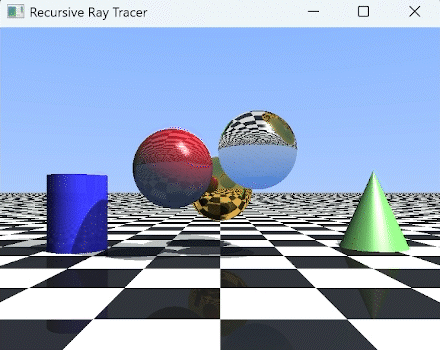

# Recursive Raytracer + Bouncing Balls

A real time recursive raytracer rendered with OpenGL/GLFW. The scene contains 3d objects lit by a point light and a directional light. Three of the spheres bounce under gravity with elastic sphere-sphere collisions.

- Recursive reflections and refractions (Snell's law) up to depth 5
- Point and directional lights with shadow rays
- Phong shading 
- Bouncing ball (sphere-sphere elastic collisions)

